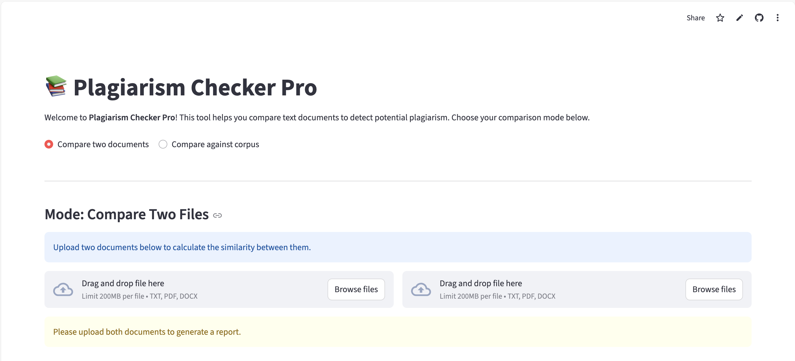

# 📄 Plagiarism Checker Pro

A sophisticated plagiarism detection tool that compares documents, calculates similarity scores, and generates detailed, sentence-level highlight reports. Built with **Python**, **Streamlit**, advanced **NLP techniques** including **Sentence-BERT embeddings**, this application provides both corpus-wide scanning via a high-performance, pre-indexed **SQLite database**, and **direct file-to-file comparison** for quick, focused analysis.[Open on Streamlit Cloud](https://plagiarism-checker-pro.streamlit.app/)

[](https://plagiarism-checker-pro.streamlit.app/)

## ✨ Features

-   **Dual Comparison Modes**:
    -   **Compare Two Files**: Directly compare two documents (`.txt`, `.pdf`, `.docx`) for similarity.
    -   **Compare Against Corpus**: Check a document against a large, pre-indexed database of other documents.
-   **Detailed Plagiarism Highlighting**: Generates a sentence-by-sentence analysis and visually highlights matching sentences in the suspect document.
-   **High-Performance Engine**:
    -   Uses a pre-indexed SQLite database to pre-computed SBERT embeddings, making corpus checks incredibly fast.
    -   Implements cosine similarity on normalized embeddings for accurate results
    -   Leverages Streamlit's caching (`@st.cache_resource` and `@st.cache_data`) for a responsive and fluid user experience.
-   **Dual Interfaces**:
    -   **Web Application**: A user-friendly interface built with Streamlit.
    -   **Command-Line Interface (CLI)**: A powerful CLI for scriptable, automated checks.
-   **Advanced Text Processing**: A robust pipeline that handles tokenization, lowercasing, stopword removal, and lemmatization.

## 🛠️ Tech Stack

-   **Language**: Python 3.9+
-   **Web Framework**: Streamlit
-   **Semantic Embeddings**: Sentence-BERT (all-MiniLM-L6-v2)
-   **Machine Learning**: Scikit-learn, PyTorch, Transformers
-   **NLP**: NLTK (for tokenization, stopwords, and lemmatization), Sentence-Transformers
-   **Database**: SQLite3
-   **File Handling**: `python-docx`, `PyMuPDF`, `pdfplumber`, `PyPDF2`


## ⚙️ Setup and Installation

Follow these steps to set up the project locally.

### 1. Clone the Repository

```bash
git clone https://github.com/Yashraj-Muthyapwar/Plagiarism-Checker.git
cd plagiarism-checker
```
### 2. Create and Activate a Virtual Environment

- Windows:
  ```
  python -m venv venv
  .\venv\Scripts\activate
  ```
- Mac:
  ```
  python3 -m venv venv
  source venv/bin/activate
  ```
### 3. Install Dependencies

```
pip install -r requirements.txt
```

### 4. Download NLTK Data
Run the setup script to download required NLTK packages:
```
python download_nltk.py
```

### 5. Build the Corpus Database and Model
Add your documents to the `data/corpus_files/` directory and run:
```
python ingest.py
```

## 🚀 Usage
The project can be run in two ways: as a **Streamlit web application** or as a **command-line tool**.

#### 1. Running the Web Application
To start the interactive web interface, run the following command:
```
streamlit run app.py
```
Your web browser should open to the application's URL (usually http://localhost:8501).

#### 2. Using the Command-Line Interface (CLI)
To compare two files directly from the command line:
```
python main_cli.py path/to/your/file1.txt path/to/your/file2.txt
```
### 📝 License
This project is licensed under the **MIT License**. See the [LICENSE](LICENSE) file for more details.
